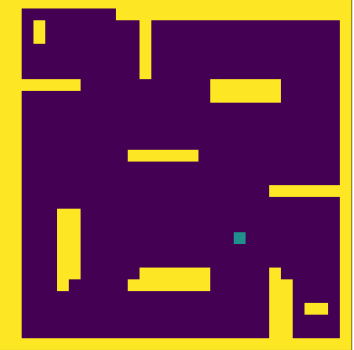

# Turtlebot Planning and Navigation

This project involves implementing a Rapidly-Exploring Random Tree (RRT) planning and navigation pipeline for the TurtleBot3 (burger model) in a Gazebo simulation. The goal was to integrate RRT with goal-seeking behavior, enabling efficient path planning and navigation while avoiding obstacles.

## Objectives

* Integrated a graph planning approach for a real robot.
* Applied appropriate control for the generated set of waypoints to navigate the robot effectively.

## File Structure

```
turtlebot_plan_nav
├── launch
│   └── plan_nav.launch # Launches the simulation and nodes
├── config
│   └── params.yaml     # Contains grid and goal position parameters
├── src                 # All custom scripts
├── stage4_grid.npy     # Grid representation of the environment
├── package.xml
└── CMakeLists.txt
```

## Requirements

* ROS workspace with the following dependencies:
  * Gazebo simulation environment
  * Python libraries: numpy, matplotlib
* Launch files to start the simulator and execute the navigation node.

## Implementation Details

### RRT Planning

* Utilized the stage4 turtlebot world defined as a numpy grid (`stage4_grid.npy`).
* The grid includes obstacles (yellow regions) and free space for navigation.
* Configured the robot’s start and goal positions via `params.yaml`.
* Implemented RRT to plan a feasible path to the goal, avoiding obstacles.

### Navigation

* Converted Cartesian goal coordinates to (row, column) indexes for graph searching.
* Translated the index path back to Cartesian coordinates for robot navigation.
* Performed goal-seeking behavior for individual coordinates while dynamically avoiding obstacles.

# Plan and Nav

You will implement graph based RRT on the stage4 turtlebot world. The same world is defined as a numpy grid called `stage4_grid.npy`. Upon loading this grid you will find the following structure.



Here, the yellow parts indicated the location of the walls. The blue square is an approximation representation of the turtlebot model in the environment (it is not present in the grid).
The configuration file in `config/params.yaml` contains 2 parameters, `grid` indicating the location of the grid file and `goal_position` indicating the cartesian position of the goal within this grid. Upon launching the node, your robot will perform the RRT planning and navigate to the goal avoiding obstacles on the way.

> Note: While grading, a different grid pattern with pseudo obstacles will be utilized. It is recommended you add pseudo obstacles during development to ensure functionality. Standard Bug-2 will be considered as invalid.

## Resources

* RRT Algorithm Overview: [YouTube Video](https://www.youtube.com/watch?v=Ob3BIJkQJEw)

## Features

* Full integration with TurtleBot3 in a Gazebo simulation.
* Supports dynamic and static obstacle environments.
* Modular ROS package design for easy deployment and testing.

## Usage

1. Clone the repository into the `src` directory of your catkin workspace.
2. Build the workspace using `catkin build`.
3. Launch the simulation and navigation pipeline:
   ```
   roslaunch turtlebot_plan_nav plan_nav.launch
   ```
4. Monitor the robot's progress in the Gazebo simulation.

## Future Enhancements

* Extend functionality for real-world TurtleBot navigation.
* Incorporate real-time dynamic obstacle handling.

---

## Final Notes

This project demonstrates the application of RRT for efficient path planning and navigation in a simulated TurtleBot environment. The system is modular and ready for further enhancements, bridging the gap between simulation and real-world robotics.
